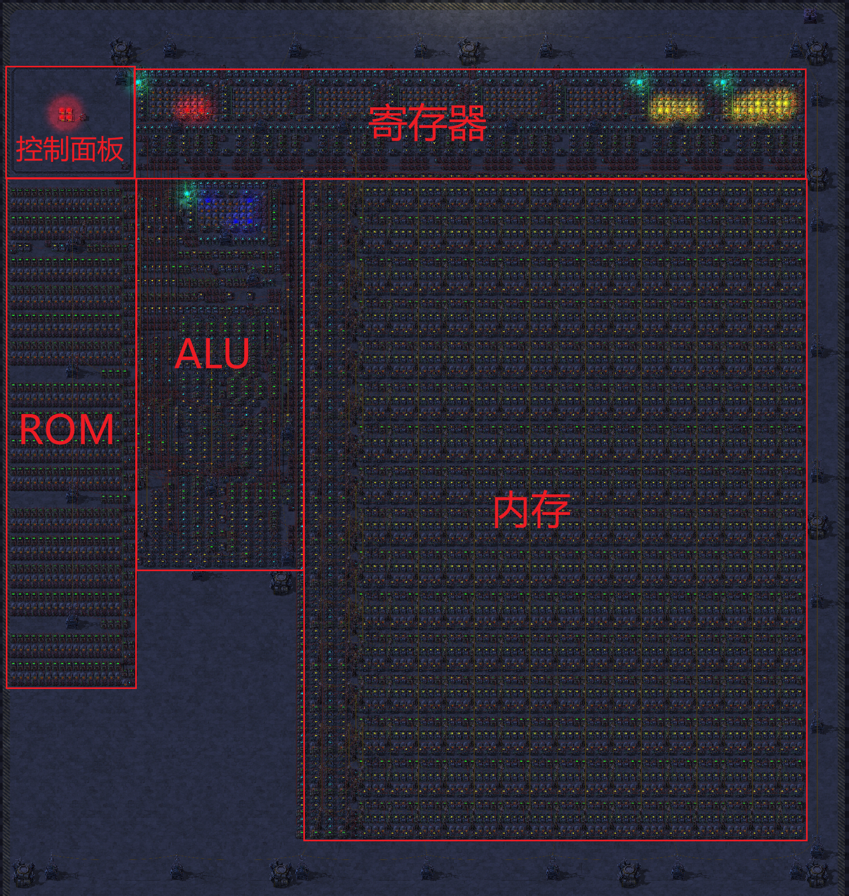
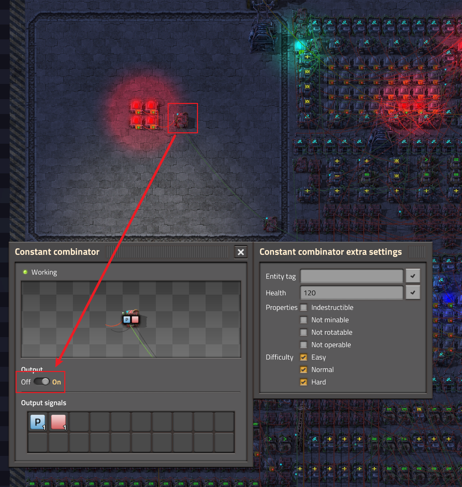
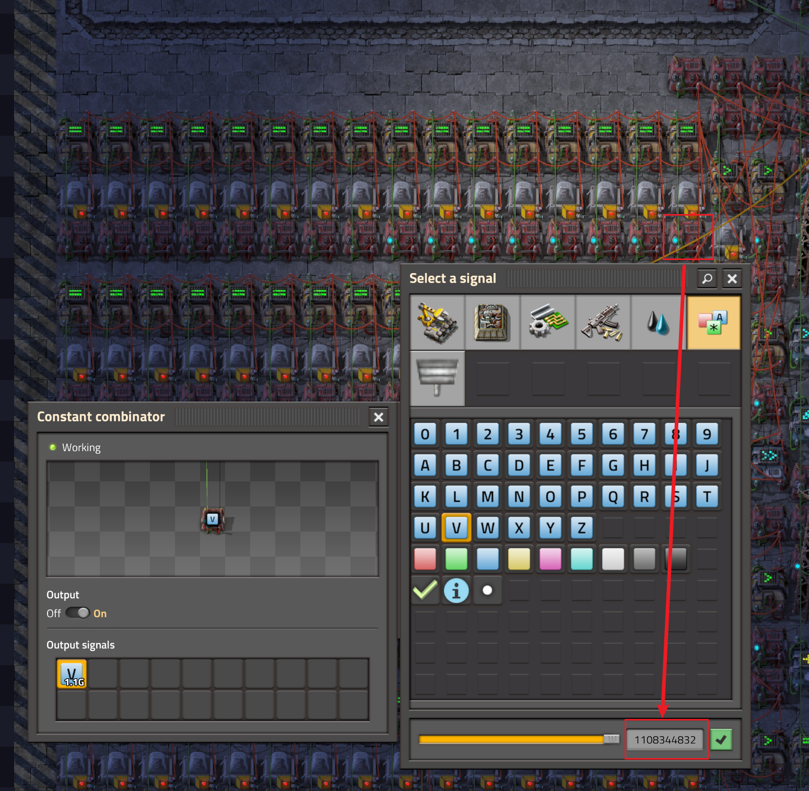
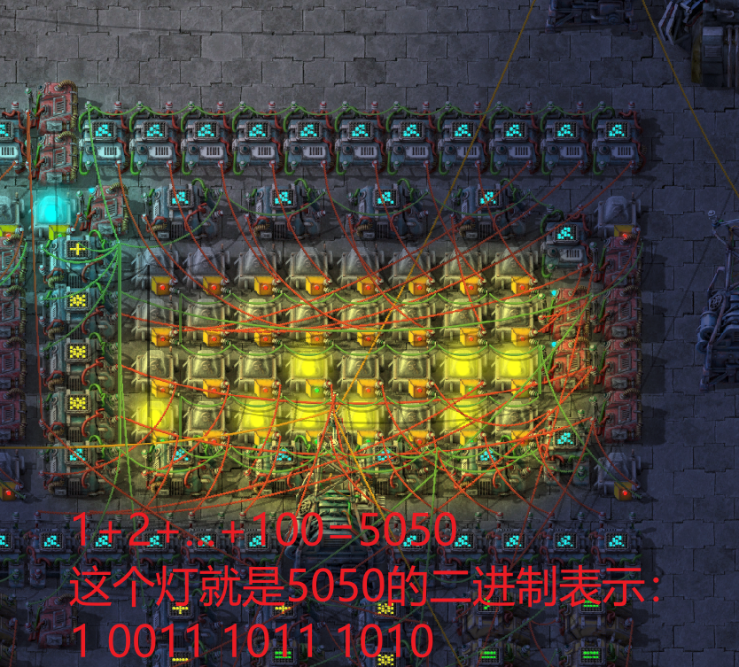
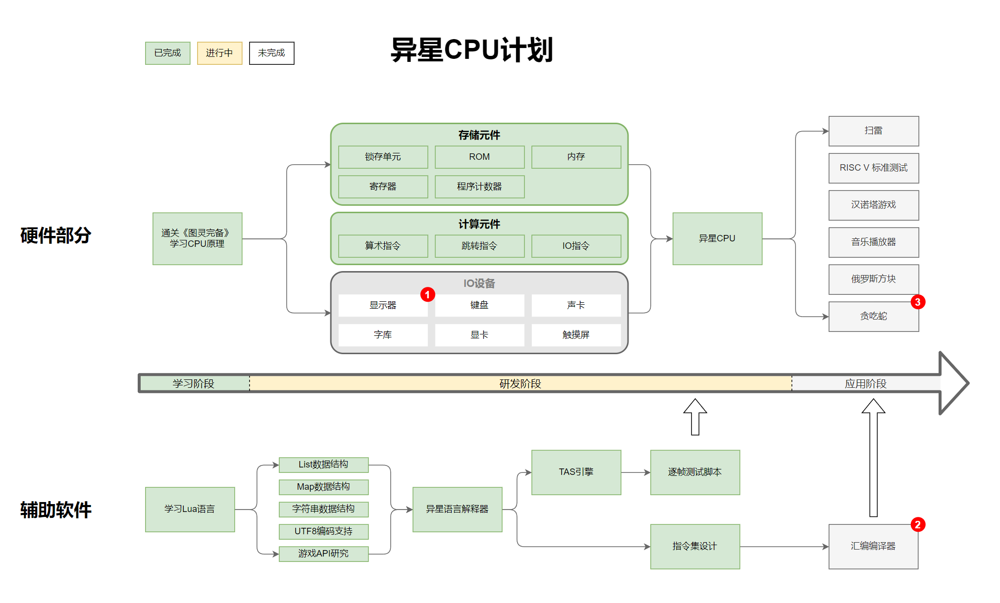

# 异星工厂 CPU 项目

[](https://opensource.org/licenses/MIT)


异星工厂 CPU 是一个为 [异星工厂](https://www.factorio.com/) 游戏打造的基于运算器搭建的自定义 CPU。本项目为玩家提供了详尽的 CPU 蓝图以及指令集说明，旨在帮助玩家在游戏中实现更为高级的自动化和计算功能，以满足各种复杂场景的需求。



## 如何开始使用

1. 请确保您已经拥有并安装了 [异星工厂](https://www.factorio.com/) 游戏。
2. 将本项目克隆或下载至本地。
3. 将 CPU 蓝图导入到游戏中。
4. 仔细阅读指令集说明，了解如何为 CPU 编写程序以及如何控制 CPU。

## 如何导入并使用蓝图

首先，在游戏内打开蓝图库，点击导入蓝图按钮并将本项目提供的 CPU 蓝图字符串粘贴到游戏中。接着，将导入的蓝图放置在游戏世界的适当位置。请确保为 CPU 提供所需的电力资源。

## 如何启动 CPU？

在 CPU 架构中找到控制面板区域，然后找到开关并将其打开。



## 指令集详解

本项目提供了一份详细的指令集说明，包括每个指令的功能、参数以及如何使用它们。您可以在 [指令集说明书.pdf](指令集说明书.pdf) 文件中找到完整的指令集列表。

在编写程序时，请务必遵循指令集文档中的格式和规范。将程序编写在游戏中的运算器上，并将其与 CPU 连接。

## 示例及演示

蓝图中已为您预设了一个样例程序。该程序的作用是计算 1+2+3+...+100 的结果。计算完成后，程序将暂停运行。

``` js
将【求和结果】视为【寄存器1】
将【循环次数】视为【寄存器2】
将【0】存到【求和结果】
将【0】存到【循环次数】
【循环开始】：
计算【循环次数】加【1】存到【循环次数】
计算【循环次数】加【求和结果】存到【求和结果】
如果【循环次数】大于等于【100】则不跳转到【循环开始】

【程序暂停】：
转到【程序暂停】
```

若您希望自行编写程序，请参照指令集说明将程序翻译成机器码，并手动将其设置到 ROM 中。以上述样例程序为例，您将得到如下编码：

``` yaml
0b010_00010_0001_00000000000000000000 = 1108344832
0b010_00010_0010_00000000000000000000 = 1109393408
0b001_00000_0010_0010_0000000000000001 = 539099137
0b000_10010_0010_0001_000000000000_0001 = 304152577
0b001_10110_0010_01100100_000000000010 = 908476418
0b010_00001_000000000000000000000101 = 1090519045
```

将右侧十进制数值写到 ROM 中：



**如何验证此 CPU 正确运行？** 根据上述程序，计算结果将存储于【寄存器1】中。寄存器1 位于寄存器区域的最右侧，上方的每个灯表示寄存器内容的二进制表示。启动 CPU 并运行一段时间后，如果得到 1+2+3+...+100=5050 的结果，说明程序运行正确：



由于当前版本未包含显示器功能，因此结果仅以二进制形式展示。

## 未来发展计划

我们为异星工厂 CPU 设定了一系列发展目标，希望能够逐步实现更多功能，以满足玩家在游戏中的各种需求。



## 如何参与贡献

我们热忱欢迎所有对此项目感兴趣的异星工厂玩家和开发者参与项目的开发。如果您希望为项目作出贡献，请遵循以下步骤：

1. Fork 这个仓库
2. 创建您的 Feature Branch（`git checkout -b feature/AmazingFeature`）
3. 提交您的更改（`git commit -m 'Add some AmazingFeature'`）
4. Push 到 Branch（`git push origin feature/AmazingFeature`）
5. 打开一个 Pull Request

## 许可证

本项目遵循 MIT 许可证 - 请查看 [LICENSE](LICENSE) 文件以了解更多详情。

## 联系方式

有任何建议或想法欢迎在Issue区讨论。

感谢您对异星工厂 CPU 的关注与支持！祝您在游戏中取得更多成就和乐趣！


# Factorio CPU Project

[](https://opensource.org/licenses/MIT)


The Factorio CPU is a custom CPU built with combinators for the [Factorio](https://www.factorio.com/) game. This project provides players with detailed CPU blueprints and an instruction set manual, aiming to help players achieve more advanced automation and computing features in the game to meet various complex scenarios.


## How to Get Started

1. Make sure you have already purchased and installed the [Factorio](https://www.factorio.com/) game.
2. Clone or download this project locally.
3. Import the CPU blueprint into the game.
4. Read the instruction set manual carefully to learn how to write programs for the CPU and how to control the CPU.

## How to Import and Use Blueprints

First, open the blueprint library in the game and click the import blueprint button. Paste the CPU blueprint string provided by this project into the game. Then, place the imported blueprint at an appropriate location in the game world. Make sure to provide the required power resources for the CPU.

## How to Start the CPU?

Find the control panel area in the CPU architecture, and then locate the switch and turn it on.


## Instruction Set Details

This project provides a detailed instruction set manual, including the function, parameters, and usage of each instruction. You can find the complete list of instruction sets in the [Instruction Set Manual.pdf](InstructionSetManual.pdf) file.

When writing programs, please follow the format and specifications in the instruction set document. Write the program on the calculator in the game and connect it to the CPU.

## Examples and Demos

A sample program is preset in the blueprint for you. The purpose of this program is to calculate the sum of 1+2+3+...+100. After the calculation is completed, the program will pause.

``` js
Treat "sum result" as "register 1"
Treat "loop counter" as "register 2"
Store "0" in "sum result"
Store "0" in "loop counter"
"Loop Start":
Calculate "loop counter" + "1" and store in "loop counter"
Calculate "loop counter" + "sum result" and store in "sum result"
If "loop counter" is greater than or equal to "100", do not jump to "Loop Start"

"Program Pause":
Jump to "Program Pause"
```

If you want to write your own program, please translate the program into machine code according to the instruction set manual and manually set it in the ROM. Taking the above example program as an example, you will get the following encoding:

``` yaml
0b010_00010_0001_00000000000000000000 = 1108344832
0b010_00010_0010_00000000000000000000 = 1109393408
0b001_00000_0010_0010_0000000000000001 = 539099137
0b000_10010_0010_0001_000000000000_0001 = 304152577
0b001_10110_0010_01100100_000000000010 = 908476418
0b010_00001_000000000000000000000101 = 1090519045
```

Write the decimal values on the right side to the ROM:


**How to verify that the CPU is running correctly?** According to the above program, the calculation result will be stored in "register 1". Register 1 is located on the far right of the register area, and each light above indicates the binary representation of the register content. After starting the CPU and running for a while, if you get the result of 1+2+3+...+100=5050, the program is running correctly:


As the current version does not include a display function, the result is only shown in binary form.

## Future Development Plans

We have set a series of development goals for the Factorio CPU, hoping to gradually achieve more functions to meet the various needs of players in the game.


## How to Contribute

We warmly welcome all Factorio players and developers interested in this project to participate in the project development. If you want to contribute to the project, please follow these steps:

1. Fork this repository
2. Create your Feature Branch (`git checkout -b feature/AmazingFeature`)
3. Commit your changes (`git commit -m 'Add some AmazingFeature'`)
